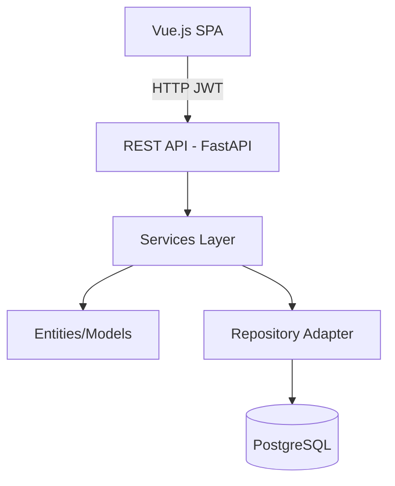

<div align="center">
  

  # DevFriend

  **A secure manager for notes, integrations, and developer secrets**

  DevFriend is a modern web app for managing user notes, OAuth-based external integrations (Gmail, GitHub, Slack), and encrypted secrets, designed following Hexagonal/Clean Architecture principles.

  [](https://fastapi.tiangolo.com/)
  [](https://vuejs.org/)
  [](https://www.postgresql.org/)
  [](https://www.docker.com/)
</div>

---

## 📋 Table of Contents
- [Features](#-features)
- [Architecture](#-architecture)
- [Tech Stack](#-tech-stack)
- [Getting Started](#-getting-started)
- [Project Structure](#-project-structure)
- [Deployment](#-deployment)
- [License](#-license)

---

## ✨ Features
- 📝 **Notes**: Full CRUD on personal notes (Markdown supported)
- 🔒 **Secrets Management**: Store OAuth/API credentials securely, encrypted with Fernet per user
- 🔑 **OAuth Integrations**:
    - Gmail: list and sync emails
    - GitHub: list repos, user profile, sync, notification count
    - Slack: (via "messages" API) list and sync channels and messages
- 👤 **Strong Auth**: JWT-based login with protected endpoints
- 🌙 **Dark Mode**: Built-in, toggleable
- 🎨 **Modern UI/UX**: Vue 3, responsive, desktop/mobile
- 🧪 **Real Testing**: Pytest coverage (backend controllers/services), Playwright E2E (frontend/UI)
- 🛡️ **Docker**: One-line start (frontend, backend, db) via Docker Compose

---

## 🏗️ Architecture
DevFriend uses real Hexagonal Architecture (Ports & Adapters):
- Strong separation: Domain, Application, Adapters (API, DB, OAuth, etc.)
- All business logic is infra-agnostic & fully tested
- PostgreSQL data source via repository adapters (non-coupled)
- Vue3 SPA frontend isolated from API
- Integrations are service-driven, supporting extension

### Architecture Overview


---

## 🛠️ Tech Stack
**Backend:**
- Python 3.12+, FastAPI, Pydantic v2
- PostgreSQL 15+, psycopg2
- JWT/Bcrypt, cryptography/Fernet
- Google, GitHub, Slack API clients
- Pytest (unit/integration)

**Frontend:**
- Vue.js 3 (Composition API)
- Axios, Vue CLI tooling
- Playwright E2E
- Custom CSS3 (dark/light)

**DevOps:**
- Docker Compose

---

## 🚀 Getting Started
**Prerequisites:** Docker & Docker Compose, Node 16+ (for frontend/dev), Python 3.12+ (if backend runs locally/not in Docker only).

**Quick start with Docker (recommended):**
```bash
git clone <YOUR_REPO_URL>
cd devFriend

# 1. Configure backend environment
cd back && cp env.example .env && cd ..

# 2. Configure frontend environment
cd front && cp env.example .env && cd ..

# 3. Launch all services
docker compose up --build
```
- Frontend: http://localhost:88
- Backend: http://localhost:8888
- API Docs (Swagger): http://localhost:8888/docs

> **Note:** By default, the backend runs with HTTPS using self-signed certificates. To run without HTTPS, edit `docker-compose.yml` and remove `--ssl-keyfile key.pem --ssl-certfile cert.pem` from the backend command. If using HTTPS, generate certificates first:
> ```bash
> cd back && openssl req -x509 -newkey rsa:4096 -keyout key.pem -out cert.pem -days 365 -nodes -subj "/CN=localhost"
> ```

**Local Development (without Docker):**
```bash
# Backend
cd back
cp env.example .env
pip install -r requirements.txt
uvicorn src.main:app --reload --port 8888

# Frontend (in another terminal)
cd front
cp env.example .env
npm install
npm run serve -- --port 88
```

**Testing:**
- Backend: `cd back && pytest`
- Frontend E2E: `cd playwright && yarn install && yarn test`

## ⚠️ Database-dependent tests & CI
Some backend tests require a running PostgreSQL instance and will attempt to connect at import time! To prevent CI and local runs without a DB from crashing, these test files include, at the top:

```python
import os
import pytest
if os.getenv("PYTEST_USE_REAL_DB") != "1":
    pytest.skip("Requires a real PostgreSQL database (set PYTEST_USE_REAL_DB=1)", allow_module_level=True)
```

- If `PYTEST_USE_REAL_DB` is not set to `1`, all integration tests that need the database are skipped on test collection, so CI never fails on missing/invalid connections.
- To run DB-dependent tests locally, be sure to start your development DB and then set the env variable `PYTEST_USE_REAL_DB=1` before running pytest.
- Unit tests (not requiring DB) always run regardless of this flag.

---

## 📁 Project Structure
```
devFriend/
├── back/
│   ├── src/
│   │   ├── api/                # REST controllers: auth, notes, secrets, integrations, etc.
│   │   ├── models/             # Pydantic models: User, Note, Secret, Integration...
│   │   ├── repositories/       # Abstractions + adapters (PostgreSQL, ABCs)
│   │   ├── services/           # Business/services logic: Auth, Note, Secret, OAuth...
│   │   ├── middleware/         # JWT/CORS
│   │   ├── utils/              # Enc/dec, OAuth client helpers
│   │   └── main.py             # FastAPI entrypoint
│   ├── tests/                  # Pytest unit/integration tests
│   ├── requirements.txt
│   ├── Dockerfile
├── front/
│   ├── src/
│   │   ├── components/         # Vue UI modules
│   │   ├── services/           # JS API adapters (auth, notes, secrets, Gmail, GitHub, Slack)
│   │   ├── assets/
│   │   ├── App.vue
│   │   └── main.js
│   ├── public/
│   ├── package.json
│   ├── Dockerfile
├── playwright/
│   ├── tests/
│   ├── Dockerfile
│   ├── package.json
├── db_schema.sql
├── docker-compose.yml
├── README.md
```

## Launch all python tests
docker-compose run --rm back python -m pytest  -v -s
## Launch PlayWright tests (local)
npx playwright test tests --headed --timeout=0

---

## 🌐 Deployment
### Docker Compose (Local/Dev, recommended):
All stack runs with one command (`docker compose up --build`). Default environment is local/dev (`env.example` is enough to start).

**Environment Variables (Backend - `back/.env`):**
- `DB_HOST`, `DB_PORT`, `DB_NAME`, `DB_USER`, `DB_PASSWORD`
- `DEVFRIEND_ENCRYPTION_KEY` (Fernet, required - generate with: `python3 -c "from cryptography.fernet import Fernet; print(Fernet.generate_key().decode())"`)
- `GOOGLE_CLIENT_ID` / `GOOGLE_CLIENT_SECRET` (for Gmail integration)
- `GITHUB_CLIENT_ID` / `GITHUB_CLIENT_SECRET` (for GitHub integration)
- `SLACK_CLIENT_ID` / `SLACK_CLIENT_SECRET` (optional, for Slack integration)
- `JWT_SECRET_KEY` (recommended to change for production)

**Environment Variables (Frontend - `front/.env`):**
- `VUE_APP_API_URL` - Backend API URL (default: `http://localhost:8888`)

**DB Schema:** Automatically set up by Docker, or init manually:
```bash
psql -h <host> -U <user> -d devfriend -f db_schema.sql
```

## Example of usage of pgadmin dockerized
docker run -d \
  --name pgadmin_devfriend \
  -p 8880:80 \
  -e PGADMIN_DEFAULT_EMAIL=admin@example.com \
  -e PGADMIN_DEFAULT_PASSWORD=supersecret \
  -v pgadmin_data_devfriend:/var/lib/pgadmin \
  dpage/pgadmin4

**Cloud:** Supports Render.com, Railway, Heroku, or any infra supporting Docker Compose and the above ENV variables. Set up OAuth redirect URIs per provider.

### Security Notes
- All sensitive data is Fernet-encrypted per user
- No secrets or keys in frontend code/repo
- JWT auth for all sensitive endpoints
- `.env` MUST NOT be versioned for production
- HTTPS required for OAuth in prod

---

## 📄 License
This project is licensed under the MIT License. See [LICENSE](LICENSE) for details.

---

<div align="center">
  Made with ❤️ for developers

  **[Report Bug](https://github.com/yourusername/devfriend/issues)** · **[Request Feature](https://github.com/yourusername/devfriend/issues)**
</div>
