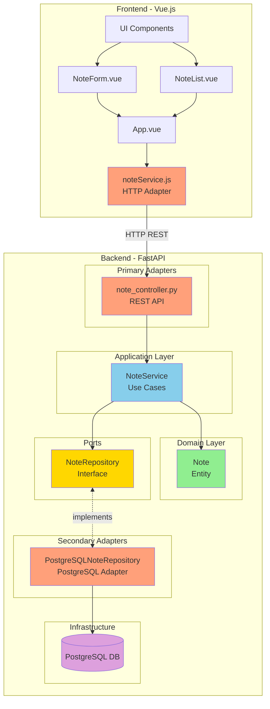

<div align="center">
  

  # DevFriend

  **Task management and resources access for software developers**

  A modern web application for managing notes and developer resources, built with clean architecture principles.

  [](https://fastapi.tiangolo.com/)
  [](https://vuejs.org/)
  [](https://www.postgresql.org/)
  [](https://www.docker.com/)
</div>

---

## 📋 Table of Contents

- [Features](#-features)
- [Architecture](#-architecture)
- [Tech Stack](#-tech-stack)
- [Getting Started](#-getting-started)
- [Project Structure](#-project-structure)
- [Deployment](#-deployment)
- [License](#-license)

---

## ✨ Features

- 📝 **Note Management**: Create, read, update, and delete notes
- 🌙 **Dark Mode**: Built-in theme switcher
- 🎨 **Modern UI**: Clean and responsive interface
- 🔒 **Secure**: PostgreSQL database with proper connection management
- 🚀 **Fast**: Built with FastAPI and Vue.js for optimal performance
- 📱 **Responsive**: Works seamlessly on desktop and mobile devices

---

## 🏗️ Architecture

DevFriend follows **Hexagonal Architecture** (Ports and Adapters) principles, ensuring:

- **Independence from frameworks**: Business logic doesn't depend on external frameworks
- **Testability**: Easy to test without infrastructure dependencies
- **Flexibility**: Simple to swap implementations (e.g., SQLite to PostgreSQL)
- **Clear separation of concerns**: Each layer has a single responsibility

### Architecture Diagram



### Layers

#### **Core (Business Logic)**
- **Domain**: `Note` entity with business rules
- **Application**: `NoteService` orchestrates use cases

#### **Ports**
- `NoteRepository`: Interface defining persistence contract

#### **Adapters**
- **Primary (Input)**: `note_controller.py` - REST API adapter
- **Secondary (Output)**: `PostgreSQLNoteRepository` - PostgreSQL implementation

---

## 🛠️ Tech Stack

### Backend
- **[FastAPI](https://fastapi.tiangolo.com/)**: Modern Python web framework
- **[Pydantic](https://pydantic-docs.helpmanual.io/)**: Data validation
- **[psycopg2](https://www.psycopg.org/)**: PostgreSQL adapter
- **[python-dotenv](https://github.com/theskumar/python-dotenv)**: Environment variables management

### Frontend
- **[Vue.js 3](https://vuejs.org/)**: Progressive JavaScript framework
- **[Vue CLI](https://cli.vuejs.org/)**: Standard tooling
- **CSS3**: Custom styling with dark mode support

### Database
- **[PostgreSQL 15](https://www.postgresql.org/)**: Robust relational database

### DevOps
- **[Docker](https://www.docker.com/)**: Containerization
- **[Docker Compose](https://docs.docker.com/compose/)**: Multi-container orchestration
- **[Render](https://render.com/)**: Cloud deployment platform

---

## 🚀 Getting Started

### Prerequisites

- Docker & Docker Compose
- Git
- Python 3 (for generating encryption keys)

### Installation

1. **Clone the repository**
   ```bash
   git clone https://github.com/yourusername/devfriend.git
   cd devfriend
   ```

2. **Configure environment variables**

   Copy the example file (it already contains a working encryption key):
   ```bash
   cd back
   cp .env.example .env
   ```

   The `.env.example` file contains all required variables with working values for local development.

3. **Start the application**
   ```bash
   docker compose up --build
   ```

   The database schema will be automatically initialized from `db_schema.sql` when PostgreSQL starts for the first time.

4. **Access the application**
   - Frontend: http://localhost:88
   - Backend API: http://localhost:8888
   - API Docs: http://localhost:8888/docs

### Local Development

#### Backend
```bash
cd back
pip install -r requirements.txt
uvicorn src.main:app --reload --port 8888
```

#### Frontend
```bash
cd front
npm install
npm run serve -- --port 88
```

---

## 📁 Project Structure

```
devfriend/
├── back/                           # Backend (FastAPI)
│   ├── src/
│   │   ├── api/                   # Primary adapters (REST API)
│   │   │   └── note_controller.py
│   │   ├── models/                # Domain entities
│   │   │   └── note.py
│   │   ├── repositories/          # Ports & Secondary adapters
│   │   │   ├── note_repository.py # Port (interface)
│   │   │   └── postgresql_repository.py # Adapter
│   │   ├── services/              # Application layer (use cases)
│   │   │   └── note_service.py
│   │   └── main.py                # FastAPI app entry point
│   ├── Dockerfile
│   └── requirements.txt
│
├── front/                          # Frontend (Vue.js)
│   ├── src/
│   │   ├── components/            # Vue components
│   │   │   ├── AppSidebar.vue
│   │   │   ├── NoteForm.vue
│   │   │   └── NoteList.vue
│   │   ├── services/              # HTTP adapters
│   │   │   └── noteService.js
│   │   ├── assets/                # Static assets
│   │   │   ├── logo.png
│   │   │   └── darkmode.png
│   │   ├── App.vue
│   │   └── main.js
│   ├── Dockerfile
│   └── package.json
│
├── docker-compose.yml              # Multi-container setup
├── diagrams.md                     # Architecture diagrams
└── README.md
```

---

## 🌐 Deployment

DevFriend is deployed on [Render](https://render.com/):

- **Frontend**: https://devfriend.onrender.com
- **Backend**: https://devfriend-back.onrender.com

### Deploy Your Own

#### 1. **Database Setup**
Create a PostgreSQL instance (Render, AWS RDS, or any PostgreSQL provider) and note the connection details.

#### 2. **Backend Environment Variables**
Configure these environment variables in your hosting platform:

**Required:**
```bash
# Database Configuration (use your production database)
DB_HOST=your-production-db-host
DB_PORT=5432
DB_NAME=devfriend
DB_USER=your-db-user
DB_PASSWORD=your-db-password

# Encryption Key (REQUIRED - generate a NEW one for production!)
# Generate with: python3 -c "from cryptography.fernet import Fernet; print(Fernet.generate_key().decode())"
DEVFRIEND_ENCRYPTION_KEY=your-production-encryption-key

# Frontend URL (REQUIRED for OAuth redirects)
FRONTEND_URL=https://your-frontend-domain.com

# Google OAuth (Required for Gmail integration and Google login)
GOOGLE_CLIENT_ID=your-google-client-id
GOOGLE_CLIENT_SECRET=your-google-client-secret

# JWT Secret (Optional - defaults to "dev-secret-key-change-in-production")
# Generate a secure random string for production
JWT_SECRET_KEY=your-secure-jwt-secret-key
```

**Backend Deployment:**
- Platform: Render, Railway, Heroku, AWS, etc.
- Build command: `pip install -r requirements.txt`
- Start command: `uvicorn src.main:app --host 0.0.0.0 --port $PORT`

#### 3. **Frontend Environment Variables**
Create a `.env.production` file in the `front/` directory:

```bash
VUE_APP_API_URL=https://your-backend-domain.com
```

**Frontend Deployment:**
- Build command: `npm install && npm run build`
- Publish directory: `dist`
- Make sure to set `VUE_APP_API_URL` as an environment variable during build

#### 4. **Google Cloud Console Configuration**
⚠️ **CRITICAL**: You must configure these redirect URIs in [Google Cloud Console](https://console.cloud.google.com/apis/credentials):

1. Go to **APIs & Services** → **Credentials**
2. Edit your OAuth 2.0 Client ID
3. Add these **Authorized redirect URIs**:
   - `https://your-backend-domain.com/auth/google/callback` (for Gmail integration)
   - `https://your-backend-domain.com/auth/google/login/callback` (for Google login)
4. **Enable Gmail API** in the APIs & Services section
5. If your app is in "Testing" mode, add test users or publish it for production use

#### 5. **Security Checklist**
- ✅ Generate a **new** `DEVFRIEND_ENCRYPTION_KEY` for production (don't use the one from `.env.example`)
- ✅ Set a secure `JWT_SECRET_KEY` (if not using default)
- ✅ Use strong database passwords
- ✅ Enable HTTPS (required for OAuth)
- ✅ Keep `.env` files out of version control
- ✅ Use environment variables, not hardcoded values

#### 6. **Database Initialization**
The database schema will be automatically initialized from `db_schema.sql` if you're using Docker. For managed databases, you may need to run the schema manually:
```bash
psql -h your-db-host -U your-db-user -d devfriend -f db_schema.sql
```

---

## 📊 Database Schema

```sql
CREATE TABLE notes (
    id SERIAL PRIMARY KEY,
    title TEXT NOT NULL,
    content TEXT,
    created_at TIMESTAMP DEFAULT CURRENT_TIMESTAMP
);
```

---

## 🤝 Contributing

Contributions are welcome! Please feel free to submit a Pull Request.

---

## 📄 License

This project is licensed under the MIT License - see the [LICENSE](LICENSE) file for details.

---

<div align="center">
  Made with ❤️ for developers by developers

  **[Report Bug](https://github.com/yourusername/devfriend/issues)** · **[Request Feature](https://github.com/yourusername/devfriend/issues)**
</div>
