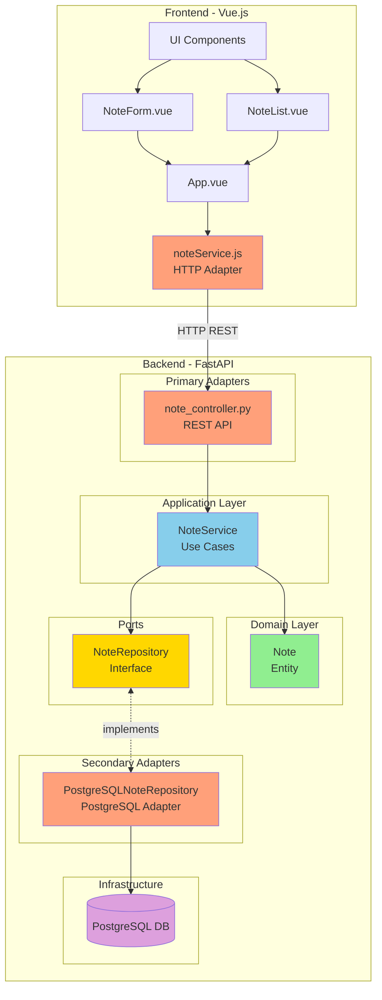

<div align="center">
  
  
  # DevFriend
  
  **Task management and resources access for software developers**
  
  A modern web application for managing notes and developer resources, built with clean architecture principles.

  [](https://fastapi.tiangolo.com/)
  [](https://vuejs.org/)
  [](https://www.postgresql.org/)
  [](https://www.docker.com/)
</div>

---

## 📋 Table of Contents

- [Features](#-features)
- [Architecture](#-architecture)
- [Tech Stack](#-tech-stack)
- [Getting Started](#-getting-started)
- [Project Structure](#-project-structure)
- [Deployment](#-deployment)
- [License](#-license)

---

## ✨ Features

- 📝 **Note Management**: Create, read, update, and delete notes
- 🌙 **Dark Mode**: Built-in theme switcher
- 🎨 **Modern UI**: Clean and responsive interface
- 🔒 **Secure**: PostgreSQL database with proper connection management
- 🚀 **Fast**: Built with FastAPI and Vue.js for optimal performance
- 📱 **Responsive**: Works seamlessly on desktop and mobile devices

---

## 🏗️ Architecture

DevFriend follows **Hexagonal Architecture** (Ports and Adapters) principles, ensuring:

- **Independence from frameworks**: Business logic doesn't depend on external frameworks
- **Testability**: Easy to test without infrastructure dependencies
- **Flexibility**: Simple to swap implementations (e.g., SQLite to PostgreSQL)
- **Clear separation of concerns**: Each layer has a single responsibility

### Architecture Diagram



### Layers

#### **Core (Business Logic)**
- **Domain**: `Note` entity with business rules
- **Application**: `NoteService` orchestrates use cases

#### **Ports**
- `NoteRepository`: Interface defining persistence contract

#### **Adapters**
- **Primary (Input)**: `note_controller.py` - REST API adapter
- **Secondary (Output)**: `PostgreSQLNoteRepository` - PostgreSQL implementation

---

## 🛠️ Tech Stack

### Backend
- **[FastAPI](https://fastapi.tiangolo.com/)**: Modern Python web framework
- **[Pydantic](https://pydantic-docs.helpmanual.io/)**: Data validation
- **[psycopg2](https://www.psycopg.org/)**: PostgreSQL adapter
- **[python-dotenv](https://github.com/theskumar/python-dotenv)**: Environment variables management

### Frontend
- **[Vue.js 3](https://vuejs.org/)**: Progressive JavaScript framework
- **[Vue CLI](https://cli.vuejs.org/)**: Standard tooling
- **CSS3**: Custom styling with dark mode support

### Database
- **[PostgreSQL 15](https://www.postgresql.org/)**: Robust relational database

### DevOps
- **[Docker](https://www.docker.com/)**: Containerization
- **[Docker Compose](https://docs.docker.com/compose/)**: Multi-container orchestration
- **[Render](https://render.com/)**: Cloud deployment platform

---

## 🚀 Getting Started

### Prerequisites

- Docker & Docker Compose
- Git

### Installation

1. **Clone the repository**
   ```bash
   git clone https://github.com/yourusername/devfriend.git
   cd devfriend
   ```

2. **Configure environment variables**
   
   Create `back/.env` file:
   ```env
   DB_HOST=postgres
   DB_PORT=5432
   DB_NAME=devfriend
   DB_USER=devfriend
   DB_PASSWORD=devfriend
   ```

3. **Start the application**
   ```bash
   docker compose up --build
   ```

4. **Access the application**
   - Frontend: http://localhost:88
   - Backend API: http://localhost:8888
   - API Docs: http://localhost:8888/docs

### Local Development

#### Backend
```bash
cd back
pip install -r requirements.txt
uvicorn src.main:app --reload --port 8888
```

#### Frontend
```bash
cd front
npm install
npm run serve -- --port 88
```

---

## 📁 Project Structure

```
devfriend/
├── back/                           # Backend (FastAPI)
│   ├── src/
│   │   ├── api/                   # Primary adapters (REST API)
│   │   │   └── note_controller.py
│   │   ├── models/                # Domain entities
│   │   │   └── note.py
│   │   ├── repositories/          # Ports & Secondary adapters
│   │   │   ├── note_repository.py # Port (interface)
│   │   │   └── postgresql_repository.py # Adapter
│   │   ├── services/              # Application layer (use cases)
│   │   │   └── note_service.py
│   │   └── main.py                # FastAPI app entry point
│   ├── Dockerfile
│   └── requirements.txt
│
├── front/                          # Frontend (Vue.js)
│   ├── src/
│   │   ├── components/            # Vue components
│   │   │   ├── AppSidebar.vue
│   │   │   ├── NoteForm.vue
│   │   │   └── NoteList.vue
│   │   ├── services/              # HTTP adapters
│   │   │   └── noteService.js
│   │   ├── assets/                # Static assets
│   │   │   ├── logo.png
│   │   │   └── darkmode.png
│   │   ├── App.vue
│   │   └── main.js
│   ├── Dockerfile
│   └── package.json
│
├── docker-compose.yml              # Multi-container setup
├── diagrams.md                     # Architecture diagrams
└── README.md
```

---

## 🌐 Deployment

DevFriend is deployed on [Render](https://render.com/):

- **Frontend**: https://devfriend.onrender.com
- **Backend**: https://devfriend-back.onrender.com

### Deploy Your Own

1. **Database**: Create a PostgreSQL instance on Render
2. **Backend**: 
   - Create a Web Service
   - Set environment variables (DB_HOST, DB_PORT, etc.)
   - Build command: `pip install -r requirements.txt`
   - Start command: `uvicorn src.main:app --host 0.0.0.0 --port $PORT`
3. **Frontend**:
   - Create a Static Site
   - Build command: `npm install && npm run build`
   - Publish directory: `dist`

---

## 📊 Database Schema

```sql
CREATE TABLE notes (
    id SERIAL PRIMARY KEY,
    title TEXT NOT NULL,
    content TEXT,
    created_at TIMESTAMP DEFAULT CURRENT_TIMESTAMP
);
```

---

## 🤝 Contributing

Contributions are welcome! Please feel free to submit a Pull Request.

---

## 📄 License

This project is licensed under the MIT License - see the [LICENSE](LICENSE) file for details.

---

<div align="center">
  Made with ❤️ for developers by developers
  
  **[Report Bug](https://github.com/yourusername/devfriend/issues)** · **[Request Feature](https://github.com/yourusername/devfriend/issues)**
</div>
