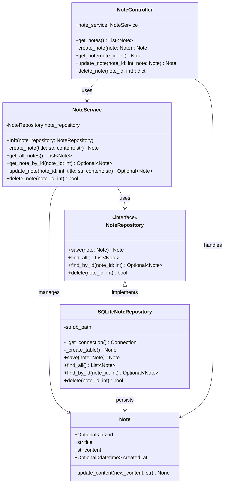
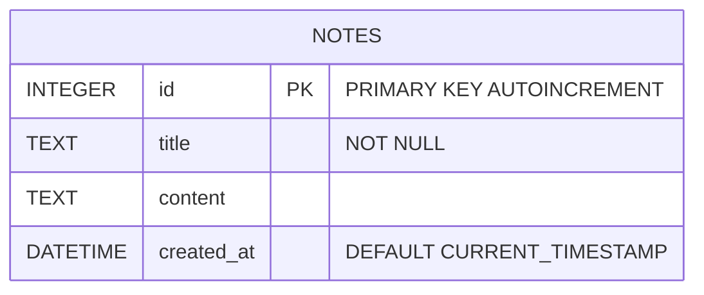
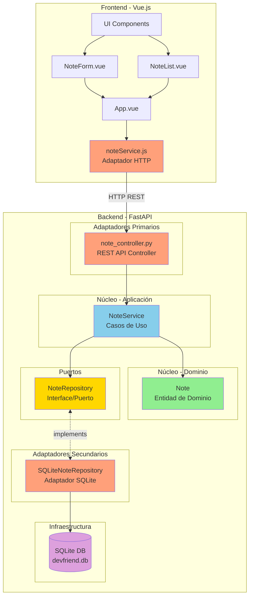
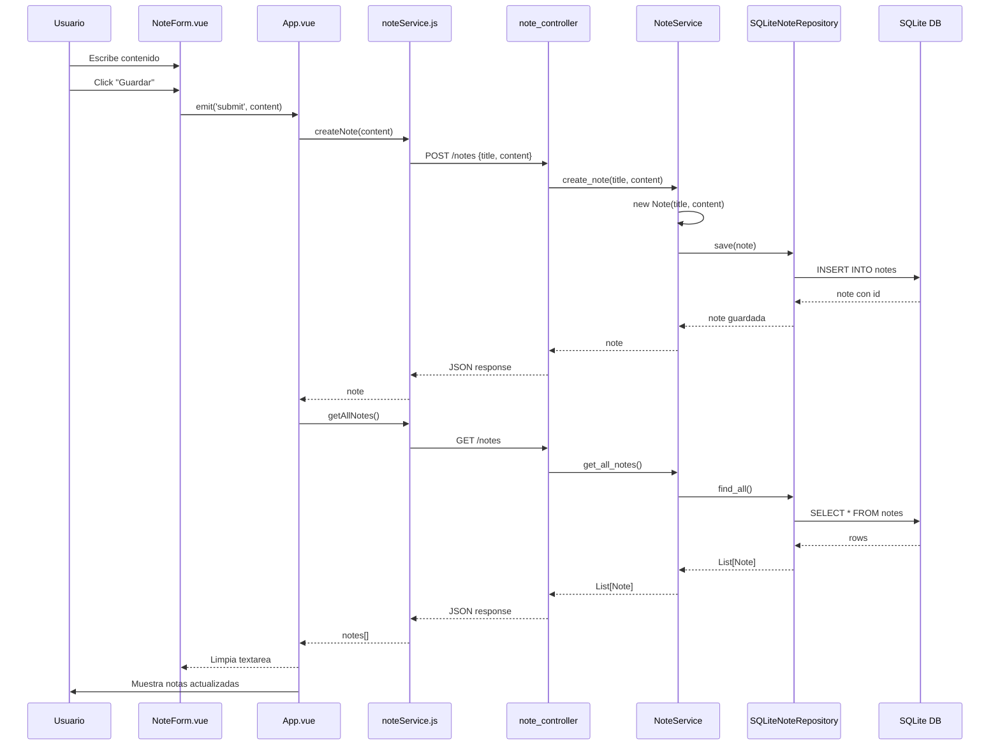
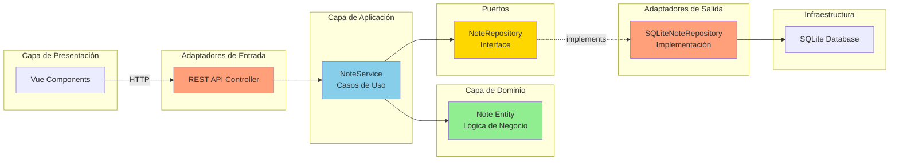

# Diagramas DevFriend

## 1. Diagrama de Clases (Backend)

## 2. Diagrama de Base de Datos

## 3. Diagrama de Arquitectura Hexagonal

## 4. Diagrama de Flujo - Crear Nota

## 5. Capas de la Arquitectura Hexagonal

---

## Notas sobre la Arquitectura

### Arquitectura Hexagonal (Puertos y Adaptadores)

**Núcleo (Core):**
- **Dominio**: `Note` - Entidad con lógica de negocio
- **Aplicación**: `NoteService` - Casos de uso y orquestación

**Puertos:**
- `NoteRepository` - Interface que define el contrato de persistencia

**Adaptadores Primarios (Driving/Input):**
- `note_controller.py` - Adaptador REST API que recibe peticiones HTTP

**Adaptadores Secundarios (Driven/Output):**
- `SQLiteNoteRepository` - Implementación concreta de persistencia en SQLite
- `noteService.js` - Adaptador HTTP en el frontend

### Beneficios de esta arquitectura:

1. **Independencia del framework**: El core no depende de FastAPI
2. **Testabilidad**: Se puede testear el core sin infraestructura
3. **Flexibilidad**: Fácil cambiar SQLite por PostgreSQL, MongoDB, etc.
4. **Separación de responsabilidades**: Cada capa tiene un propósito claro
5. **Inversión de dependencias**: El core define las interfaces, no la infraestructura

